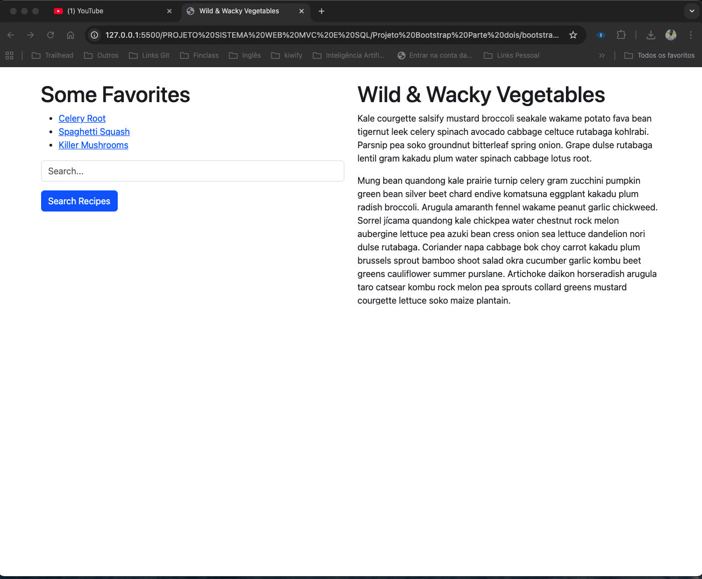
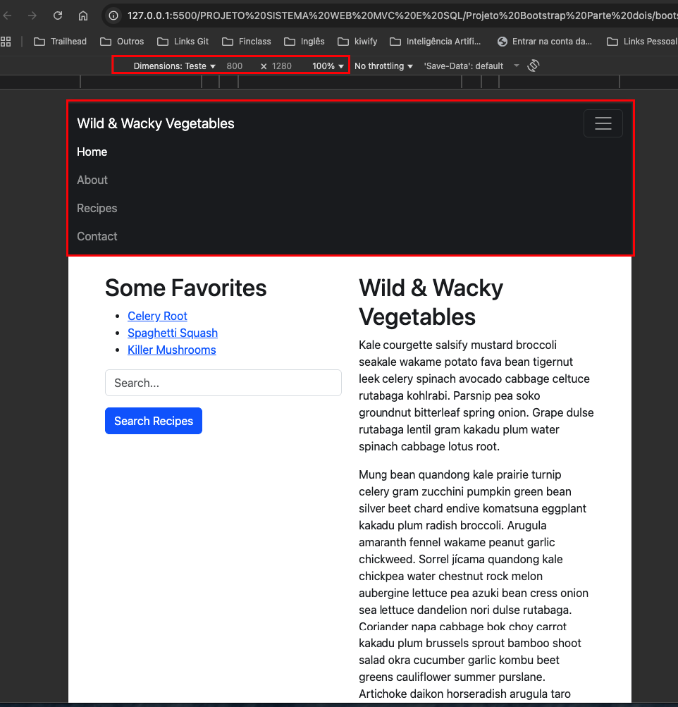

# Projeto Bootstrap - Wild & Wacky Vegetables

Este projeto demonstra a implementação de um layout responsivo utilizando Bootstrap 5.3.3 em uma aplicação Spring Boot.

## 📋 Exercícios Implementados

### 2. Layout com Grid System e Text Classes
**Objetivo:** Usar as classes Grid System e Text do Bootstrap para criar o layout abaixo.

**Classes utilizadas:**
- `container` - Container responsivo
- `row` - Linha do grid system
- `col-md-6` - Colunas que ocupam 50% da largura em telas médias e grandes
- `text-primary` - Cor azul nos links
- `form-control` - Estilização do campo de input
- `btn btn-primary` - Botão estilizado

**Evidência:**

### 3. Header Responsivo Básico (Navbar)
**Objetivo:** Criar uma navbar com marca e links visível em 'lg+' e dentro do colapso em 'lg-'.

**Classes utilizadas:**
- `navbar` - Componente de navegação principal
- `navbar-expand-lg` - Menu expande apenas em telas grandes (≥992px)
- `navbar-dark bg-dark` - Tema escuro com fundo preto
- `navbar-toggler` - Botão hambúrguer para telas pequenas
- `collapse navbar-collapse` - Sistema de colapso responsivo
- `me-auto` - Margem automática para alinhamento à esquerda

**Explicação das escolhas:**
- **navbar-expand-lg**: Escolhido para que o menu seja colapsado em tablets e smartphones (< 992px) e expandido em desktops
- **navbar-dark bg-dark**: Combinação para melhor contraste visual com texto branco
- **collapse**: Permite que os links sejam escondidos/mostrados responsivamente

**Evidências:**
- **800px**: Menu colapsado (ícone hambúrguer)
- **1280px**: Menu expandido (todos os links visíveis)

## 🚀 Tecnologias Utilizadas
- **Spring Boot 2.7.3**
- **Bootstrap 5.3.3**
- **Thymeleaf** (Template Engine)
- **HTML5 & CSS3**

## 📱 Responsividade
O projeto é totalmente responsivo, adaptando-se a diferentes tamanhos de tela:
- **Mobile** (< 768px): Layout em coluna única
- **Tablet** (768px - 991px): Menu colapsado, colunas adaptadas
- **Desktop** (≥ 992px): Layout completo com menu expandido

## 🎯 Funcionalidades
- ✅ Layout responsivo em 2 colunas
- ✅ Navbar com colapso automático
- ✅ Campo de pesquisa funcional
- ✅ Links de navegação estruturados
- ✅ Design moderno com Bootstrap

---
**Desenvolvido por:** Cristian Passos  
**Data:** Outubro 2025