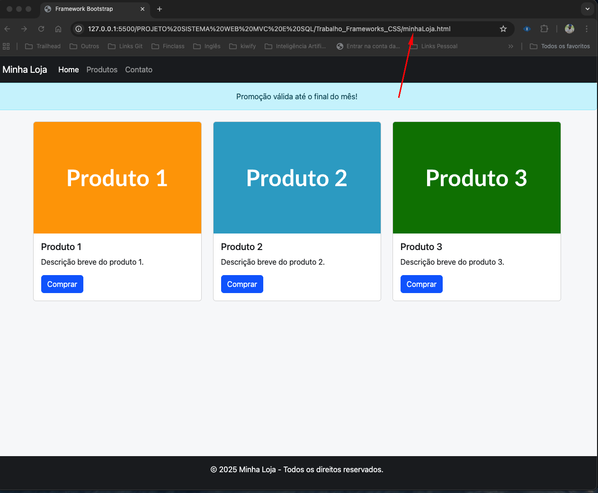

# README - minhaLoja.html

## Descrição
Página principal da loja virtual desenvolvida com Bootstrap 5. Esta é a página inicial que apresenta os produtos disponíveis para compra.

## Estrutura da Página

### Componentes Principais:

1. **Navbar (Barra de Navegação)**
   - Logo da loja "Minha Loja"
   - Menu responsivo com links: Home, Produtos, Contato
   - Classe: `navbar navbar-expand-lg navbar-dark bg-dark`

2. **Alerta Promocional**
   - Banner informativo sobre promoções
   - Texto: "Promoção válida até o final do mês!"
   - Classe: `alert alert-info text-center m-0`

3. **Container de Produtos**
   - Layout em grid responsivo com 3 colunas
   - Cada produto possui:
     - Imagem placeholder
     - Título do produto
     - Descrição breve
     - Botão "Comprar" que redireciona para página específica

4. **Rodapé**
   - Informações de copyright
   - Posicionado na parte inferior da página usando `mt-auto`

### Classes Bootstrap Utilizadas:
- `bg-light` - Fundo claro para o body
- `d-flex flex-column min-vh-100` - Layout flexbox ocupando altura total
- `container mt-4` - Container responsivo com margem superior
- `row` e `col-md-4` - Sistema de grid responsivo
- `card` - Componente de cartão para produtos
- `btn btn-primary` - Botões estilizados

### Funcionalidades:
- **Responsividade**: Adapta-se a diferentes tamanhos de tela
- **Navegação**: Links funcionais entre páginas
- **Interatividade**: Botões de compra redirecionam para páginas de produto

### Arquivos Relacionados:
- `produto1.html` - Página de destino do Produto 1
- `produto2.html` - Página de destino do Produto 2
- `produto3.html` - Página de destino do Produto 3

### Tecnologias Utilizadas:
- HTML5
- Bootstrap 5.3.3 (CSS Framework)
- Responsive Design

## Como Visualizar:
1. Abra o arquivo no VS Code
2. Use a extensão Live Server
3. Clique com botão direito → "Open with Live Server"
4. A página será aberta no navegador com atualização automática

