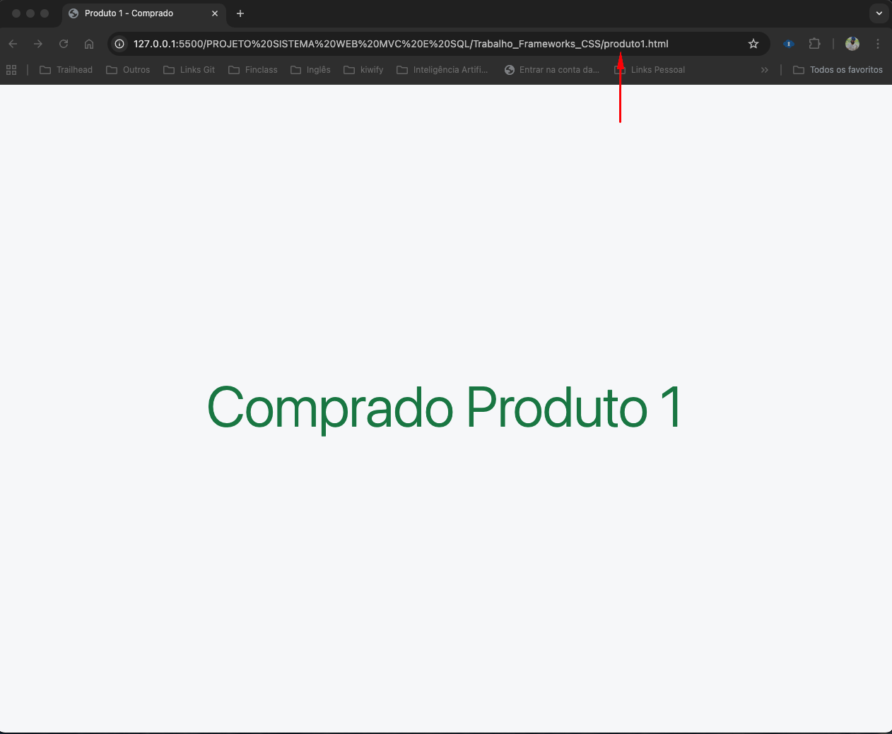

# README - produto1.html

## Descrição
Página de confirmação de compra para o Produto 1. Esta é uma página simples que confirma a ação de compra realizada pelo usuário.

## Estrutura da Página

### Componentes:

1. **Estrutura HTML Completa**
   - DOCTYPE HTML5
   - Meta tags para charset e viewport
   - Título específico: "Produto 1 - Comprado"
   - Inclusão do Bootstrap 5.3.3

2. **Body**
   - Layout centralizado usando Flexbox
   - Fundo claro (`bg-light`)
   - Ocupa toda a altura da viewport (`min-vh-100`)

3. **Conteúdo Principal**
   - Mensagem "Comprado" centralizada
   - Estilo grande e destacado (`display-1`)
   - Cor verde de sucesso (`text-success`)

### Classes Bootstrap Utilizadas:
- `bg-light` - Fundo claro
- `d-flex align-items-center justify-content-center` - Centralização perfeita
- `min-vh-100` - Altura mínima de 100% da viewport
- `text-center` - Alinhamento de texto centralizado
- `display-1` - Tamanho de fonte grande
- `text-success` - Cor verde para indicar sucesso

### Funcionalidades:
- **Confirmação Visual**: Indica claramente que a compra foi realizada
- **Design Minimalista**: Foco total na mensagem de confirmação
- **Responsividade**: Funciona em todos os dispositivos
- **Centralização Perfeita**: Usa Flexbox para centralizar vertical e horizontalmente

### Navegação:
- Esta página é acessada através do botão "Comprar" do Produto 1 na página principal
- Arquivo de origem: `minhaLoja.html`

### Tecnologias Utilizadas:
- HTML5
- Bootstrap 5.3.3
- Flexbox CSS

## Propósito:
Simular uma página de confirmação de compra em um e-commerce básico, proporcionando feedback visual imediato ao usuário sobre a ação realizada.

