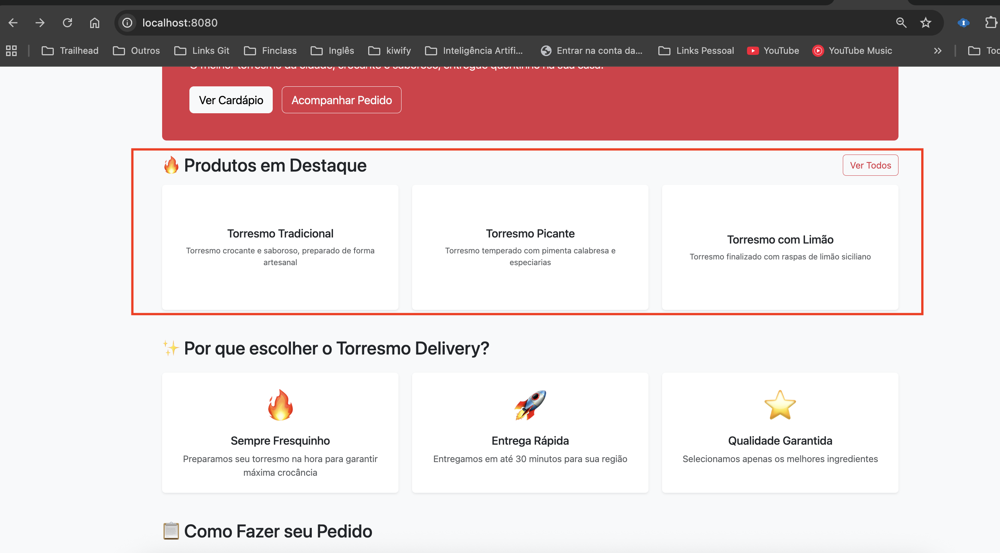

# Torresmo — Notas da Mudança (Produtos em Destaque)

Este README serve para você colar o print/screenshot que demonstra a seção "Produtos em Destaque" na `home.html`.

O que foi feito (resumo):

- Adicionado o campo `destaque` no modelo `Produto` (tipo Boolean).
- Ajustado `ProdutoController.home()` para enviar a lista `destaques` (produtos onde `destaque == true`).
- Inserida seção "Produtos em Destaque" no template `src/main/resources/templates/home.html`.
- Botão "Ver Todos" adicionado ao canto direito da seção (aponta para `/produtos`).

- Print evidência

